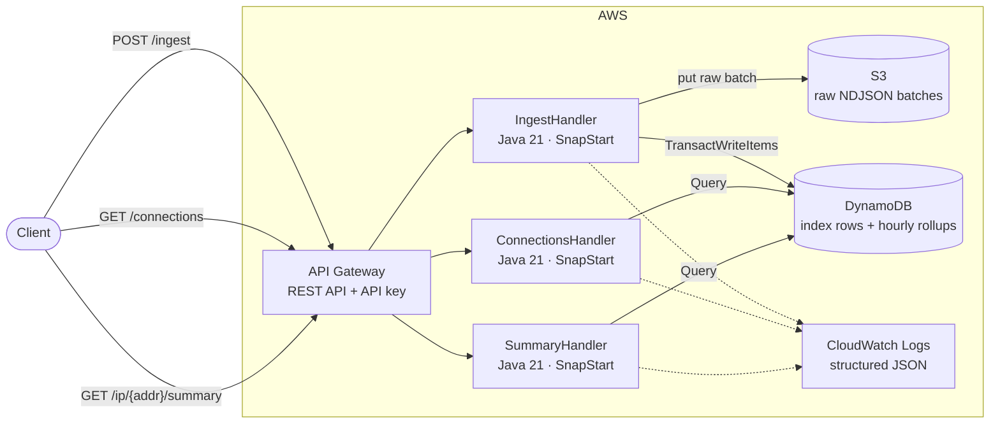
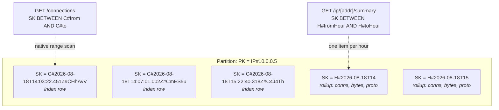
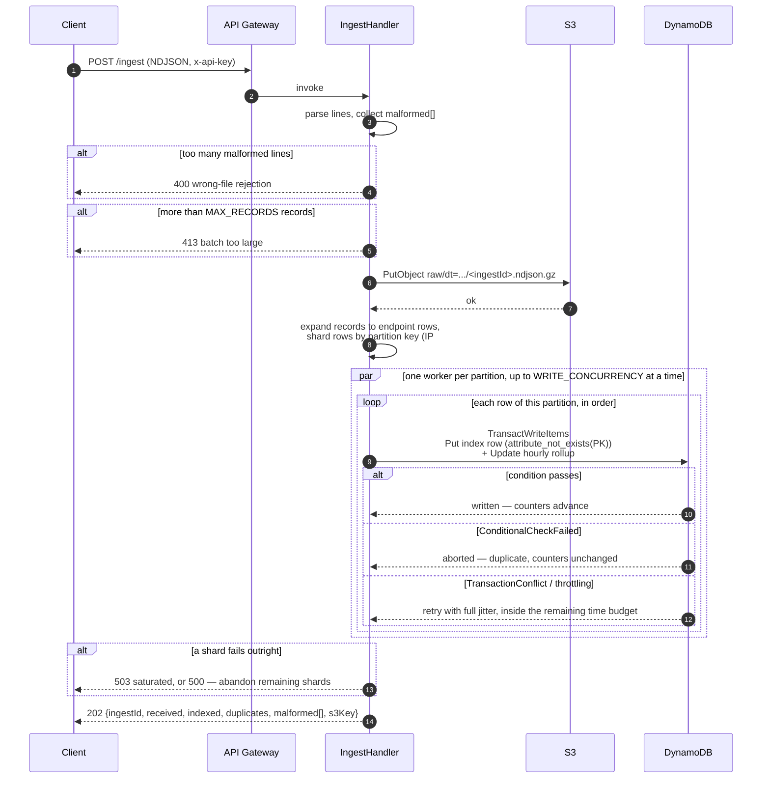
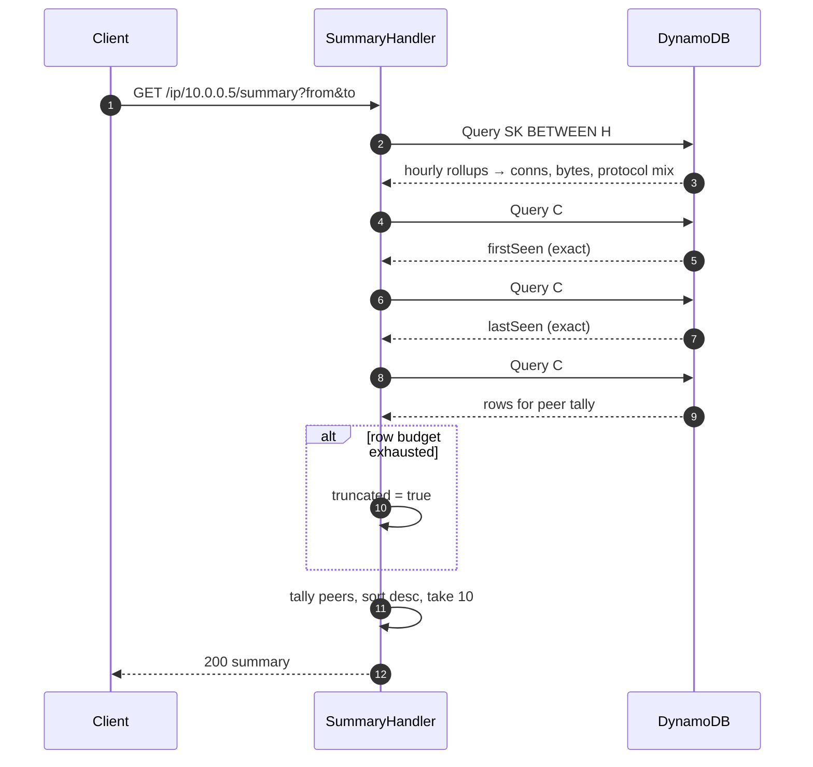

# flowdex

flowdex is a serverless index over Zeek `conn.log` records. It answers one
question quickly: show me every connection involving this IP in this time
window, and summarise what that IP was doing. That's the first move in most
network-security triage — an alert names an address, and the analyst needs
its activity before anything else — and flowdex answers it with a bucket, a
table, and three functions instead of a SIEM.

This is also a portfolio project. Design decisions below are optimised for
being explainable, not only for working: where a shortcut would be
defensible in a weekend project but hard to defend in an interview, the
longer path was taken and the reason is written down.

## Architecture

Three Lambda functions behind one API Gateway REST API, one DynamoDB table,
one S3 bucket. No VPC, no persistent compute, no servers.



## Data model

Table `flowdex`, partition key `PK` (string), sort key `SK` (string),
on-demand billing. Two row types share a partition:

| Row type | PK | SK | Purpose |
|---|---|---|---|
| Index | `IP#<addr>` | `C#<iso8601>#<uid>` | one per connection per endpoint |
| Rollup | `IP#<addr>` | `H#<yyyy-MM-ddTHH>` | hourly counters for that IP |



Timestamps are ISO-8601 UTC with exactly three fractional digits
(`2026-08-18T14:03:22.451Z`). Fixed width is load-bearing: it makes
lexicographic sort order equal chronological order, which is what lets a
time range be a native sort-key `BETWEEN` with no secondary index. `C#`
sorts before `H#`, so index rows and rollups occupy contiguous,
separately-addressable ranges of the same partition. Every stored sort key
also carries a `#<uid>` suffix, which is what makes the upper bound of a
range query exclusive without a sentinel character: a record at exactly
`to` sorts above the bare `C#<to>` bound and falls outside the range.

## Ingest and idempotency

`POST /ingest` accepts NDJSON, gzipped or not, and works out which by
looking at the body rather than at a header.

That is not fussiness. API Gateway REST decides whether a body is binary by
`Content-Type`, while gzip is conventionally announced with
`Content-Encoding` — two different headers. Listing specific binary types
therefore breaks the most natural request a client can send
(`Content-Type: application/x-ndjson` plus `Content-Encoding: gzip`): the
gateway decodes those bytes as UTF-8 and the handler receives rubbish. So
`infra/api.tf` sets `binary_media_types = ["*/*"]`, which is safe under
`AWS_PROXY` because the handler already branches on `isBase64Encoded`, and
`Body.decode` identifies gzip by its magic number `1f 8b` — which NDJSON
cannot begin with — instead of trusting either header. Every reasonable
spelling of "here is a gzipped file" works, including the one curl produces
when you point it at a `.gz` and say nothing at all.

Per connection record, per endpoint, one `TransactWriteItems` containing a
conditional `Put` of the index row and an `Update` of that hour's rollup.
Re-POSTing the same file fails every condition, aborts every transaction,
and moves no counter — idempotency and aggregation are solved by the same
mechanism, because a counter can only advance when the row it describes is
genuinely new.



The raw object is written to S3 before indexing begins. If indexing dies
partway, the bytes are durable and re-POSTing is safe — storage first,
derived data second.

## Read path



## Design decisions

Several of these deviate from the original design spec, each for a reason
found while building. Deviations are marked.

**Two rows per connection.** Every connection is written once under the
originator's address and once under the responder's, so a query against
either endpoint finds it directly. Both rows are complete — attributes,
byte orientation, everything — and neither is a pointer to the other. A
read never has to hop from one row to a second lookup.

**One row for a self-connection.** *(Deviation.)* When `id.orig_h` equals
`id.resp_h` — loopback traffic, hairpin NAT — writing the "two" rows above
would mean two identical `PK` + `SK` pairs, which collide rather than
coexist. Endpoints are the distinct set of addresses involved in a
connection, and for a self-connection that set has one member, so one row
is written. It's also the honest count: one connection involving one
address is one row, not two.

**Transactions.** Each write pairs a conditional `Put` of the index row
with an `Update` of the hourly rollup in one `TransactWriteItems`.
Idempotency and aggregation share this single mechanism — a counter can
only advance when the row it describes is genuinely new, because the
`Update` only lands if the `Put`'s `attribute_not_exists(PK)` condition
passes.

**Explicit transaction-conflict retry.** *(Deviation.)* DynamoDB reports
`TransactionConflict` as a cancellation reason wrapped inside a
`TransactionCanceledException`, not as a retryable error class of its own,
so the AWS SDK's default retry policy never retries it. Concurrent ingest
contends on the same rollup items constantly, so `IndexStore` inspects the
cancellation reasons itself: `ConditionalCheckFailed` means a genuine
duplicate and is not retried, while `TransactionConflict` or
`ThrottlingError` means the write is retried. Without this, concurrent
ingest would surface routine contention as failed writes.

The backoff uses **full jitter** — a uniform random draw from `[0, ceiling)`
rather than the ceiling itself. A deterministic ladder is actively harmful
here: writers that collide on one rollup item collide at the same instant,
so a shared ladder wakes them together and they collide again, with the
backoff re-synchronising the very contention it was meant to spread. And
the retry is budgeted against `context.getRemainingTimeInMillis()` rather
than a fixed number of attempts, because sleeping past the moment an answer
was still useful turns a `503` the client can act on into a bare timeout,
which says strictly less. Exhausting the retries is a `503`, not a `500` —
"we are loaded, back off", not "our bug, do not retry".

**Protocol counts as top-level attributes.** *(Deviation.)* The spec called
for a nested `proto` map updated with `SET proto.#p = if_not_exists(...)`.
In practice, an update that both creates the parent map and increments a
child count in the same expression is rejected by DynamoDB as overlapping
document paths, and `ADD` — which would sidestep that — only works on
top-level attributes, not nested ones. Because a transaction can only touch
a given item once, the rollup update has to be a single expression; there
is no single-expression form that maintains a nested map under contention.
Rollup rows instead store protocol counts as top-level attributes named
`proto#tcp`, `proto#udp`, and so on, reached through an expression-name
alias per protocol. This is storage only — the API response still nests
them under `protocols`.

**First and last seen come from index rows, not rollups.** DynamoDB cannot
express min or max in an `UPDATE`, and emulating one with conditional
writes produces transactions that abort on perfectly ordinary data. The
summary handler instead runs two `Limit 1` queries against the index rows
for the requested range — one forward for `firstSeen`, one reverse for
`lastSeen`. Two single-item reads give exact answers with none of that
write-path complexity.

**Counters are hour-granular; peers, first/last seen are exact — and the
two need not reconcile.** Rollup counters come from hourly buckets, so a
request window of 14:30–15:30 is served by the 14:00 and 15:00 rollups in
full. `firstSeen`, `lastSeen`, and the peer tally are computed directly
from index rows within the exact requested window. The response carries
both `window` (what was asked) and `windowCovered` (the hour-aligned range
the counters actually describe), so a reviewer never has to guess why the
connection count and the peer list don't line up to the minute — they're
answering slightly different questions on purpose, and the response says
so.

**The last covered hour is derived from `to` minus one millisecond.**
*(Deviation.)* The index range is upper-exclusive, so an hour-aligned `to`
like `15:00:00.000Z` covers no part of the 15:00 hour — yet truncating `to`
straight to the hour would pull in the 15:00 rollup and report a whole
hour of traffic that falls outside the window the caller asked for.
`HourWindow` truncates `to.minusMillis(1)` instead, which is correct for
aligned, mid-hour, sub-hour and one-millisecond-past inputs alike, and
keeps `windowCovered` an honest description of what the counters cover.

**The write path validates what the read path validates.** *(Deviation.)*
Anything that becomes part of a key or a counter is checked at parse time,
because a bad value there is not a bad response — it is a permanently
unreachable row or a corrupted aggregate. `id.orig_h`/`id.resp_h` must be
IP literals, since a hostname would be indexed under a `PK` every read path
rejects. Timestamps must fall inside [1970, 2100], because `uuuu` emits a
signed, wider year outside four digits and `+`/`-` sort below every digit —
one such record would sort ahead of the entire index. Ports must be
0–65535. Negative byte counts and durations are clamped to zero, because
they feed an `ADD` on the shared hourly rollup and `ADD` with a negative
value *decrements*: one crafted line would otherwise reach in and corrupt
an aggregate describing every other record in that hour.

**Truncation is never silent.** *(Deviation.)* Peer tallying reads at most
5 pages of 1000 rows. DynamoDB sets `LastEvaluatedKey` whenever a query
stops on `Limit`, with no way to tell "more rows remain" from "that was
exactly the last row" — so exhausting the page budget is not, by itself,
evidence of truncation. flowdex settles it with one extra `Limit 1` probe
past the budget: if it returns a row, `truncated` is `true`; if not, the
peer list is already complete and the flag is `false`. A flag that
over-reports partial results teaches analysts to ignore it, which costs
exactly what silent truncation costs.

**Ingest is parallel by partition, not by record, and caps batches at 5,000
records.** *(Deviation.)* Sequential per-record transactions cannot fit
inside API Gateway's 29-second ceiling at the 5 MB body cap — thousands of
transactions at 8–12 ms each is minutes, not seconds. So `IngestHandler`
dispatches across a fixed 32-thread pool (`WRITE_CONCURRENCY`), sized for an
I/O-bound workload: the threads wait on DynamoDB rather than compute, so
pool size is not bound by the function's 2048 MB (~1.15 vCPU) allocation.

The unit of parallelism is the **partition**, and that is the whole point.
Sharding by record is the obvious choice and the wrong one: every record
bumps its endpoints' hourly rollup items, so a file about one busy address
puts all 32 threads on the same rollup item, where their transactions
cancel each other with `TransactionConflict` faster than any retry ladder
can absorb. Grouping rows by partition key and giving each partition a
single owner *removes* that contention instead of backing off from it — two
workers never touch the same rollup — while leaving cross-address
parallelism, which is where the throughput actually is, untouched.

`MAX_RECORDS = 5_000` makes the resulting boundary something the caller
reads in an error message rather than discovers by timeout. The number
comes from the smallest of three real ceilings: a brand-new on-demand table
serves ~4,000 WCU/s before it has doubled its way up, and 5,000 records is
~10,000 transactions and ~40,000 WCU, or ~10 s on the very first ingest
into a fresh stack; a single partition caps near 1,000 WCU/s in any billing
mode, which is ~250 transactions/s for one address; and the gateway gives
up at 29 s regardless.

**Queries accept only canonical dotted-quad IPv4 or literal IPv6.**
*(Deviation.)* Screening the `ip` parameter by character class alone still
let an all-digit string above 2^32 fall through to `InetAddress.getByName`,
which performs a real DNS lookup for anything it doesn't recognise as a
literal — a query parameter that could trigger several seconds of
resolution from inside the function. `Params` matches IPv4 against a strict
dotted-quad pattern before any resolution is attempted. This isn't just
safer, it's the correct read of the input: Zeek writes canonical addresses,
so requiring canonical form rejects nothing a real `conn.log` would ever
produce.

**Pagination cursors are validated against the whole query, not just the
partition.** *(Deviation.)* The cursor returned by `GET /connections`
encodes DynamoDB's `LastEvaluatedKey`, and it is handed straight back to
DynamoDB as an `ExclusiveStartKey` — which makes it caller-controlled input
to a query. `CursorCodec.decode`, invoked via `IndexStore.queryConnections`,
therefore checks every property the query depends on: the `PK` matches the
`ip` being asked about, so a cursor minted while paging one address cannot
page another; exactly the two key attributes are carried forward, since a
third would be a `ValidationException` against a two-attribute schema; the
sort key starts with `C#`, so a hand-crafted cursor cannot start the scan
inside the `H#` rollup rows; the sort key falls inside the requested time
range, which is the *common* misuse — page once, then narrow `from`/`to`
while still holding the cursor; and both cursor and sort key are length-
capped below DynamoDB's own limits.

Each of those is a client mistake and each now answers `400 INVALID_CURSOR`.
DynamoDB would have rejected most of them too, but as a `ValidationException`
surfacing as a `500` — telling the caller "our fault" about their own token.
A translation of any residual start-key `ValidationException` to a `400`
remains as a backstop.

**Response numeric types are chosen per field, not per value.** Ports,
byte counts, and line numbers are always serialised as JSON integers;
`duration` is always a float. DynamoDB stores numbers as strings and trims
trailing zeroes, so a `duration` of `1.0` is stored as `"1"` — deciding the
JSON type from the stored string would make that field flip between an
integer and a float from row to row. Typing is decided by which field it
is, not by what the value happens to look like.

**One IAM role per function, and no `Transact*` action.** *(Deviation.)*
DynamoDB transactions have no IAM action of their own — `TransactWriteItems`
is authorised by the permissions on the operations it contains — so a
transaction of one conditional `Put` and one `Update` needs exactly
`dynamodb:PutItem` and `dynamodb:UpdateItem`.

The grants are per function rather than per stack. A single shared role is
the easy shape and it means the two read handlers hold `PutItem`,
`UpdateItem` and `s3:PutObject` they can never use — which makes "least
privilege" a claim rather than a property. `infra/lambda.tf` builds a role
and inline policy per function with `for_each`: ingest gets `PutItem`,
`UpdateItem` and `s3:PutObject`; `connections` and `summary` get
`dynamodb:Query` and nothing else. Each function's log grant is scoped to
its own log group, and none of them holds `logs:CreateLogGroup` — the
groups are Terraform-managed with a retention policy, so a function that
cannot create one cannot leave an unretained group behind after a destroy.

**Raw S3 objects are write-only through the API.** The Lambda role holds
`s3:PutObject` only — no `s3:GetObject`. Each index row names the exact
`s3Key` and `s3Line` it came from, but redeeming that provenance means
reading the object with your own AWS credentials outside the API, not
through any flowdex endpoint.

**Local Terraform state.** State stays local and gitignored. Remote state
with a lock table is the right call for a team, and unjustified
infrastructure for a solo project that would need to stand up a bucket and
a lock table just to hold state for a handful of resources.

**No Spring.** Framework startup is precisely the cost a function should
not pay. Handlers implement `RequestHandler` directly against AWS SDK v2,
with no dependency-injection container between the runtime and the code.

**SnapStart, and why the API points at an alias.** Java cold starts of
1–3s drop to roughly 200–500ms by restoring a snapshot of an already-
initialised JVM. SnapStart operates on published versions, not `$LATEST`,
so Terraform publishes a version per function and the API Gateway
integration targets a `live` alias pointed at that version — the deploy
pipeline is never allowed to leave the integration pointed at `$LATEST`,
which would silently disable SnapStart.

**SnapStart is primed at checkpoint, not on the first request.**
*(Deviation.)* Building a client is cheap; using one for the first time is
not. A restored snapshot still pays, on its first real invocation, for
operation marshallers, the signer, the JSON and XML protocol machinery,
first TLS and the JIT passes over all of it — one to two seconds, which is
most of what SnapStart was supposed to buy, and none of it captured by
merely constructing the clients at class-init. `Clients` registers a CRaC
`beforeCheckpoint` hook that issues one of each operation the handlers use
and throws the answers away.

Those priming requests are signed with deliberately **fake** static
credentials, which is the load-bearing detail rather than a shortcut.
Priming with the real clients would drive the default credential provider
chain during init, and its resolved credentials would be baked into the
snapshot and replayed — expired — by every restore, which is exactly what
building the clients without credentials was avoiding. Fake credentials
exercise marshalling, signing and transport in full and are rejected at
authentication: nothing read, nothing written, no credential captured.

**The HTTP connection pool is sized to the writer pool.** *(Deviation.)*
`UrlConnectionHttpClient` wraps `HttpURLConnection`, whose keep-alive cache
holds `http.maxConnections` idle connections *per host* — and the JDK
default is 5. With 32 writers against one DynamoDB endpoint, all but five
completed connections are discarded and most transactions pay a fresh TLS
handshake: latency, and handshake crypto competing for the same cores as
everything else. There is no builder setting for it — the cache is
JDK-global and reads the property once — so `Clients` sets
`http.maxConnections` in its static initialiser, before the first
connection is opened and inside the SnapStart snapshot.

**Ingest may outlive the gateway; the readers may not.** *(Deviation.)* The
two read functions time out at 29 s, matching API Gateway, because a read
that outlives the gateway has nobody left to answer and only burns money.
Ingest is set to 120 s on purpose. If ingest also died at 29 s, every
gateway timeout would stop indexing mid-flight and leave a half-written
batch the client must re-POST from scratch. Letting the function run on
means the 504'd request still *completes* in the background, so the
client's retry reports duplicates and does no work. Idempotency is what
makes that safe; without it, this would be a double-counting bug.

**Responses carry the API Gateway request id.** *(Deviation.)* There are
two request ids in play and they are not interchangeable.
`Context.getAwsRequestId()` identifies the Lambda *invocation* and appears
only in the function's own log stream. The gateway request id identifies
the *HTTP request*, and it is what appears in gateway access logs and
`x-amzn-RequestId` — so it is the only one an analyst holding a response
can use to find the request again. `x-flowdex-request-id` carries the
gateway id, falling back to the Lambda id for invocations that did not
arrive through the gateway.

**REST API over HTTP API.** API keys and usage plans are a REST API
feature. HTTP API is cheaper and lower-latency but has no equivalent way to
gate access without adding a Lambda authorizer — more moving parts than a
single-key access control requirement justifies.

## Non-goals

- **Authentication and multi-tenancy.** An API Gateway API key gates
  access. It is not user authentication and is not presented as such.
- **Log types beyond `conn.log`.** No `dns.log`, `http.log`, `ssl.log`.
- **Live capture.** flowdex consumes files. It does not tap networks, read
  pcaps, or run Zeek.
- **Subnet or cross-IP queries.** Lookups are by exact address.
- **Retention, lifecycle, archival.** Data accumulates until the stack is
  destroyed.
- **Alerting, detection, scoring.** Retrieval only.
- **A user interface.** HTTP API only.
- **Scale beyond a single-partition-per-IP model.** See "Where this
  design's ceiling is" below for what changes when that ceiling is
  reached.

## Where this design's ceiling is

Knowing the ceiling matters more than raising it:

- **One very hot IP in one batch — a real 413/504, not a theoretical one.**
  All rows for an address share a partition, a single partition caps near
  1,000 WCU/s in any billing mode, and adaptive capacity cannot split one
  partition key. Since ingest gives each partition a single owner, a
  scan-shaped batch — one scanner against thousands of targets — is written
  serially against that ceiling and can exceed the gateway's 29 s. The
  client sees a `504`. This is safe rather than merely tolerable: the
  function keeps running to 120 s and finishes, so a re-POST reports
  duplicates instead of redoing the work, and a `5xx` from ingest always
  means "progress unknown, re-POST is the recovery". Batches over
  `MAX_RECORDS` get a `413` up front instead. The fix at real volume is
  sharding the partition key by time or hash suffix, at the cost of
  scatter-gather reads.
- **Synchronous ingest.** Files arrive in a request body, capped at 5 MB.
  Real volume would land in S3 directly by presigned URL and trigger
  indexing by event notification, or stream through Kinesis or Kafka.
- **Per-record transactions.** Two rows per record, one transaction each,
  is simple and slow. Batching amortises it; batching plus idempotency is
  harder, which is the trade-off being made deliberately here.
- **Retrieval only.** Aggregations beyond per-IP hourly counters — top
  talkers across a whole subnet, arbitrary field search — want Athena over
  the S3 objects or OpenSearch, not DynamoDB.
- **Rollup queries are capped by window, not by pages.**
  `IndexStore.queryRollups` still pages until it runs out of rollup rows,
  with no page budget like the peer scan's explicit 5-page cap. What bounds
  it is the summary window: `Params.MAX_SUMMARY_WINDOW` rejects anything
  over 366 days with a `400`, so the worst case is a year of hourly rows
  rather than a request that pages until it times out.

Known behaviours that are deliberate, and worth stating so they are not
mistaken for bugs:

- **A "duplicate" may be an update that was dropped.** Zeek re-logs
  long-lived connections (rotation, `conn_long`) with the same `uid` and
  start `ts` but updated byte counts. The second record fails the
  `attribute_not_exists` condition and its bytes are discarded — first
  write wins. That is the correct behaviour for an idempotent index, but it
  does mean `duplicates` counts "already known" rather than "identical".
- **ICMP has no ports.** Zeek reuses `id.orig_p` and `id.resp_p` for ICMP
  message type and code, so for ICMP records `localPort` and `peerPort`
  carry a type and a code under port names. Values outside 0–65535 are
  rejected as malformed either way.
- **Millisecond granularity.** Sort keys carry three fractional digits.
  `from` and `to` are truncated to milliseconds on the way in, so
  sub-millisecond precision in a request is rounded down rather than
  honoured.
- **A trailing empty page.** When the number of remaining rows is an exact
  multiple of `limit`, DynamoDB returns a full page *with* a
  `LastEvaluatedKey`, so the following request returns an empty `items` and
  no cursor. Clients that loop until there is no cursor are unaffected.
- **Gateway-generated errors do not share the error envelope.** A `403`
  for a missing API key or a `429` from the usage plan is produced by API
  Gateway before the function is invoked, so it carries neither
  `x-flowdex-request-id` nor the `{error:{code,message,details}}` shape.
  Only responses from flowdex itself do. (`x-amzn-RequestId` is still
  present on those.)
- **`202` on ingest is generous.** Ingest completes synchronously, so `200`
  or `201` would be the more accurate code. The contract is frozen at
  `202`; it is noted here rather than quietly rationalised.
- **S3 raw objects are partitioned by ingest time, not event time.** The
  `dt=`/`hour=` prefixes are ingest wall-clock UTC. A future Athena story
  over these objects would therefore prune on the wrong axis for
  event-time queries, and a re-POST writes a second object with the same
  records — which such a query would double-count. The DynamoDB index is
  the deduplicated view; S3 is the immutable arrival log.

## Build and test

```bash
mvn verify        # unit + LocalStack integration tests, builds target/flowdex.jar
```

Requires Java 21 and a running Docker daemon. The integration tests run
real DynamoDB and S3 APIs in a LocalStack container via Testcontainers.
`pom.xml` sets failsafe's `api.version` system property from the
`docker.api.version` property, defaulting to `1.40`, because Testcontainers
1.20.6's bundled docker-java otherwise asks for Docker API 1.32 by default,
which modern daemons reject. `1.40` is a deliberate **floor**, not a
current value: a daemon accepts any version at or below its own, so asking
low works everywhere modern while asking high fails with "client version
too new" — the inverse problem, and the one that would break CI runners and
clean clones rather than one developer's box. Override it if you ever need
to: `mvn verify -Ddocker.api.version=1.44`.

## Deploy

Configure credentials and a region first. The AWS provider chain reads
`~/.aws`, and nothing in this repository supplies either one. Without them
`terraform apply` fails with "No valid credential sources found" — having
walked the whole chain down to an EC2 IMDS lookup that cannot succeed on a
laptop — and the `aws` CLI fails with `NoRegion`. `var.region` defaults to
`us-east-1`, but it is a provider input rather than an environment variable,
so the CLI never sees it and needs its own.

```bash
aws configure   # access key, secret, region, output format
```

That writes `~/.aws/credentials` and `~/.aws/config`. Give it the access key
of the dedicated IAM user described below, and the region you intend to deploy
into — passing the same one as `-var region=...` if it is not `us-east-1`.

```bash
mvn package
cd infra
terraform init
terraform apply -var budget_email=you@example.com
```

Deploy with a dedicated IAM user rather than root or an admin key.
`infra/deploy-policy.json` is that user's policy — it is a reference
artifact applied by hand when you create the user, deliberately not managed
by this stack, since a stack cannot bootstrap the credentials used to
create it. It grants the API Gateway, Lambda, DynamoDB, S3, IAM, Logs and
Budgets actions this configuration actually performs, with `iam:PassRole`
restricted to the roles the stack itself creates.

The budget in `infra/budget.tf` is **account-wide**, not stack-scoped. AWS
budgets filter by cost allocation tag, and those take up to 24 hours to
activate and are not retroactive — so a stack-scoped budget would be blind
exactly when a fresh mistake needs catching. That is the right trade for a
dedicated personal account and the wrong one for a shared account. It
notifies at 80% of actual spend and at 100% of *forecast*: actual is the
truthful signal but lags Cost Explorer by 8–24 hours, and the forecast is
what tells you about a runaway on the day it starts.

Read the API key:

```bash
aws apigateway get-api-key --api-key "$(terraform output -raw api_key_id)" \
  --include-value --query value --output text
```

## Ingest and query

```bash
API=$(cd infra && terraform output -raw api_url)
KEY=<the key value from above>

curl -sS -X POST "$API/ingest" \
  -H "x-api-key: $KEY" \
  -H 'content-type: application/x-ndjson' \
  --data-binary @samples/conn-sample.ndjson

# Gzipped, the natural way. The magic-number sniff means the headers do not
# have to agree with each other, or say anything at all about compression.
gzip -kf samples/conn-sample.ndjson
curl -sS -X POST "$API/ingest" \
  -H "x-api-key: $KEY" \
  -H 'content-type: application/x-ndjson' \
  -H 'content-encoding: gzip' \
  --data-binary @samples/conn-sample.ndjson.gz

curl -sS -G "$API/connections" \
  -H "x-api-key: $KEY" \
  --data-urlencode 'ip=10.0.0.5' \
  --data-urlencode 'from=2026-08-18T00:00:00Z' \
  --data-urlencode 'to=2026-08-19T00:00:00Z'

curl -sS -G "$API/ip/10.0.0.5/summary" \
  -H "x-api-key: $KEY" \
  --data-urlencode 'from=2026-08-18T00:00:00Z' \
  --data-urlencode 'to=2026-08-19T00:00:00Z'
```

Re-run the ingest command: `indexed` drops to 0, `duplicates` rises, and no
counter moves.

## Teardown

The bucket is deliberately not `force_destroy`, so data is never removed
as a side effect of a destroy. Empty it first:

```bash
aws s3 rm "s3://$(cd infra && terraform output -raw bucket)" --recursive
cd infra && terraform destroy
```
