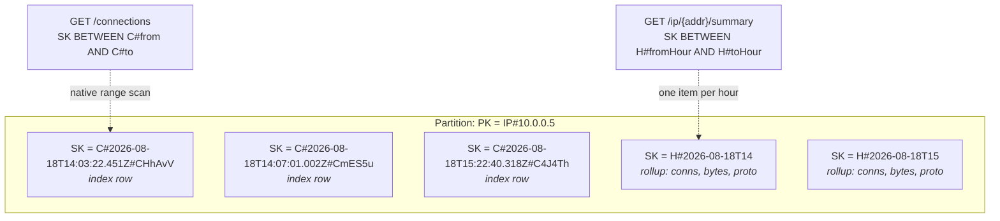
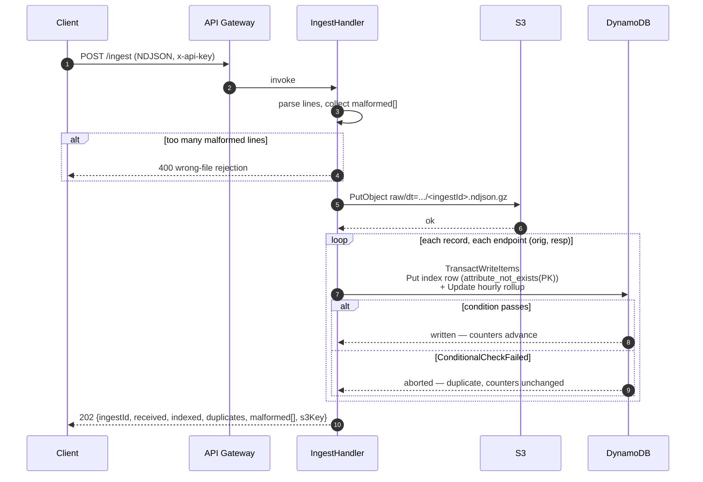
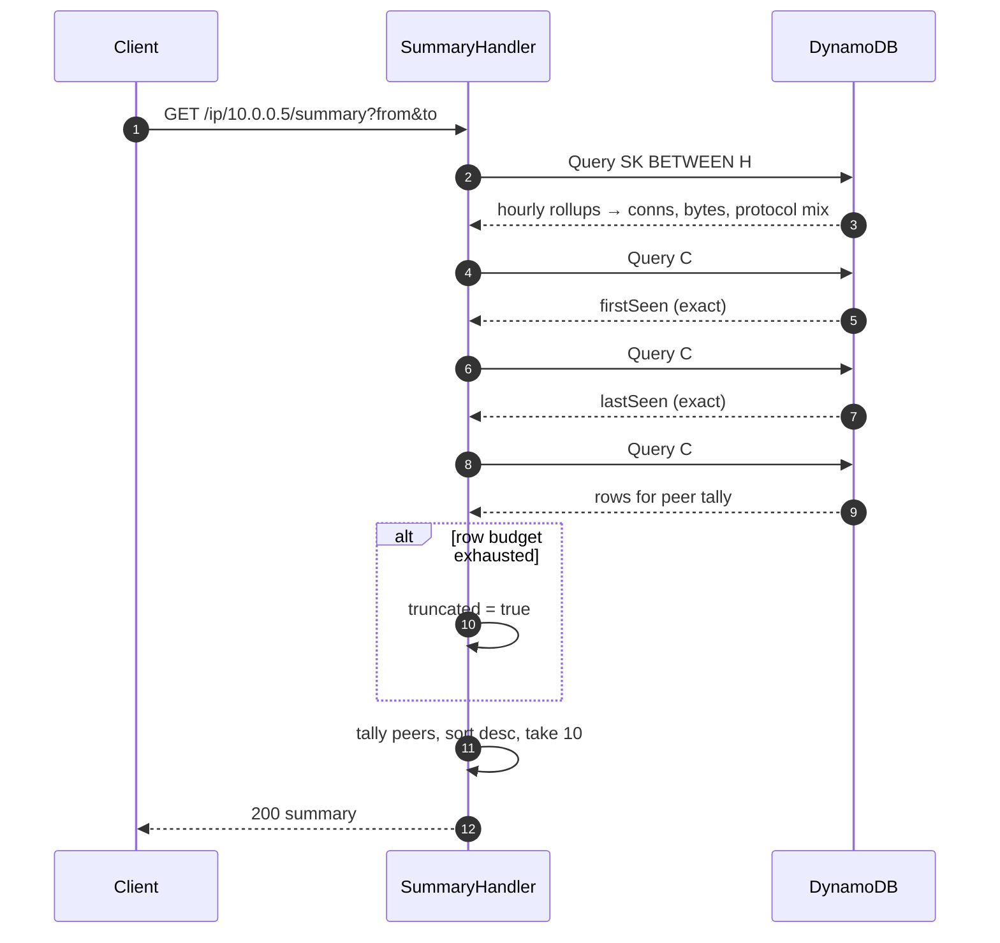

# flowdex

flowdex is a serverless index over Zeek `conn.log` records. It answers one
question quickly: show me every connection involving this IP in this time
window, and summarise what that IP was doing. That's the first move in most
network-security triage — an alert names an address, and the analyst needs
its activity before anything else — and flowdex answers it with a bucket, a
table, and three functions instead of a SIEM.

This is also a portfolio project. Design decisions below are optimised for
being explainable, not only for working: where a shortcut would be
defensible in a weekend project but hard to defend in an interview, the
longer path was taken and the reason is written down.

## Architecture

Three Lambda functions behind one API Gateway REST API, one DynamoDB table,
one S3 bucket. No VPC, no persistent compute, no servers.


## Data model

Table `flowdex`, partition key `PK` (string), sort key `SK` (string),
on-demand billing. Two row types share a partition:

| Row type | PK | SK | Purpose |
|---|---|---|---|
| Index | `IP#<addr>` | `C#<iso8601>#<uid>` | one per connection per endpoint |
| Rollup | `IP#<addr>` | `H#<yyyy-MM-ddTHH>` | hourly counters for that IP |



Timestamps are ISO-8601 UTC with exactly three fractional digits
(`2026-08-18T14:03:22.451Z`). Fixed width is load-bearing: it makes
lexicographic sort order equal chronological order, which is what lets a
time range be a native sort-key `BETWEEN` with no secondary index. `C#`
sorts before `H#`, so index rows and rollups occupy contiguous,
separately-addressable ranges of the same partition. Every stored sort key
also carries a `#<uid>` suffix, which is what makes the upper bound of a
range query exclusive without a sentinel character: a record at exactly
`to` sorts above the bare `C#<to>` bound and falls outside the range.

## Ingest and idempotency

Per connection record, per endpoint, one `TransactWriteItems` containing a
conditional `Put` of the index row and an `Update` of that hour's rollup.
Re-POSTing the same file fails every condition, aborts every transaction,
and moves no counter — idempotency and aggregation are solved by the same
mechanism, because a counter can only advance when the row it describes is
genuinely new.



The raw object is written to S3 before indexing begins. If indexing dies
partway, the bytes are durable and re-POSTing is safe — storage first,
derived data second.

## Read path



## Design decisions

Several of these deviate from the original design spec, each for a reason
found while building. Deviations are marked.

**Two rows per connection.** Every connection is written once under the
originator's address and once under the responder's, so a query against
either endpoint finds it directly. Both rows are complete — attributes,
byte orientation, everything — and neither is a pointer to the other. A
read never has to hop from one row to a second lookup.

**One row for a self-connection.** *(Deviation.)* When `id.orig_h` equals
`id.resp_h` — loopback traffic, hairpin NAT — writing the "two" rows above
would mean two identical `PK` + `SK` pairs, which collide rather than
coexist. Endpoints are the distinct set of addresses involved in a
connection, and for a self-connection that set has one member, so one row
is written. It's also the honest count: one connection involving one
address is one row, not two.

**Transactions.** Each write pairs a conditional `Put` of the index row
with an `Update` of the hourly rollup in one `TransactWriteItems`.
Idempotency and aggregation share this single mechanism — a counter can
only advance when the row it describes is genuinely new, because the
`Update` only lands if the `Put`'s `attribute_not_exists(PK)` condition
passes.

**Explicit transaction-conflict retry.** *(Deviation.)* DynamoDB reports
`TransactionConflict` as a cancellation reason wrapped inside a
`TransactionCanceledException`, not as a retryable error class of its own,
so the AWS SDK's default retry policy never retries it. Concurrent ingest
contends on the same rollup items constantly, so `IndexStore` inspects the
cancellation reasons itself: `ConditionalCheckFailed` means a genuine
duplicate and is not retried, while `TransactionConflict` or
`ThrottlingError` means the write is retried with backoff. Without this,
concurrent ingest would surface routine contention as failed writes.

**Protocol counts as top-level attributes.** *(Deviation.)* The spec called
for a nested `proto` map updated with `SET proto.#p = if_not_exists(...)`.
In practice, an update that both creates the parent map and increments a
child count in the same expression is rejected by DynamoDB as overlapping
document paths, and `ADD` — which would sidestep that — only works on
top-level attributes, not nested ones. Because a transaction can only touch
a given item once, the rollup update has to be a single expression; there
is no single-expression form that maintains a nested map under contention.
Rollup rows instead store protocol counts as top-level attributes named
`proto#tcp`, `proto#udp`, and so on, reached through an expression-name
alias per protocol. This is storage only — the API response still nests
them under `protocols`.

**First and last seen come from index rows, not rollups.** DynamoDB cannot
express min or max in an `UPDATE`, and emulating one with conditional
writes produces transactions that abort on perfectly ordinary data. The
summary handler instead runs two `Limit 1` queries against the index rows
for the requested range — one forward for `firstSeen`, one reverse for
`lastSeen`. Two single-item reads give exact answers with none of that
write-path complexity.

**Counters are hour-granular; peers, first/last seen are exact — and the
two need not reconcile.** Rollup counters come from hourly buckets, so a
request window of 14:30–15:30 is served by the 14:00 and 15:00 rollups in
full. `firstSeen`, `lastSeen`, and the peer tally are computed directly
from index rows within the exact requested window. The response carries
both `window` (what was asked) and `windowCovered` (the hour-aligned range
the counters actually describe), so a reviewer never has to guess why the
connection count and the peer list don't line up to the minute — they're
answering slightly different questions on purpose, and the response says
so.

**Truncation is never silent.** *(Deviation.)* Peer tallying reads at most
5 pages of 1000 rows. DynamoDB sets `LastEvaluatedKey` whenever a query
stops on `Limit`, with no way to tell "more rows remain" from "that was
exactly the last row" — so exhausting the page budget is not, by itself,
evidence of truncation. flowdex settles it with one extra `Limit 1` probe
past the budget: if it returns a row, `truncated` is `true`; if not, the
peer list is already complete and the flag is `false`. A flag that
over-reports partial results teaches analysts to ignore it, which costs
exactly what silent truncation costs.

**Ingest indexes concurrently and caps batches at 20,000 records.**
*(Deviation.)* Sequential per-record transactions cannot fit inside API
Gateway's 29-second integration ceiling at the 5 MB body cap — roughly
34,000 transactions at 8–12ms each is minutes, not seconds. `IngestHandler`
indexes records on a fixed 32-thread pool (`WRITE_CONCURRENCY`), sized for
an I/O-bound workload on a 1 vCPU function, which brings a full batch
inside the limit. `MAX_RECORDS = 20_000` makes the resulting boundary
something the caller reads in an error message rather than discovers by
timeout.

**Queries accept only canonical dotted-quad IPv4 or literal IPv6.**
*(Deviation.)* Screening the `ip` parameter by character class alone still
let an all-digit string above 2^32 fall through to `InetAddress.getByName`,
which performs a real DNS lookup for anything it doesn't recognise as a
literal — a query parameter that could trigger several seconds of
resolution from inside the function. `Params` matches IPv4 against a strict
dotted-quad pattern before any resolution is attempted. This isn't just
safer, it's the correct read of the input: Zeek writes canonical addresses,
so requiring canonical form rejects nothing a real `conn.log` would ever
produce.

**Pagination cursors are bound to their partition.** The cursor returned by
`GET /connections` encodes DynamoDB's `LastEvaluatedKey`, which includes
`PK`. `ConnectionsHandler` checks the decoded `PK` against the `ip` being
queried before using it, so a cursor minted while paging one address can't
be replayed against another — it fails instead of silently paging through
the wrong partition.

**Response numeric types are chosen per field, not per value.** Ports,
byte counts, and line numbers are always serialised as JSON integers;
`duration` is always a float. DynamoDB stores numbers as strings and trims
trailing zeroes, so a `duration` of `1.0` is stored as `"1"` — deciding the
JSON type from the stored string would make that field flip between an
integer and a float from row to row. Typing is decided by which field it
is, not by what the value happens to look like.

**IAM grants no `Transact*` action.** DynamoDB transactions have no IAM
action of their own — `TransactWriteItems` is authorised by the
permissions on the operations it contains. A transaction of one
conditional `Put` and one `Update` needs exactly `dynamodb:PutItem` and
`dynamodb:UpdateItem` (plus `dynamodb:Query` for the read handlers); the
Lambda role in `infra/lambda.tf` is scoped to exactly those, nothing wider.

**Local Terraform state.** State stays local and gitignored. Remote state
with a lock table is the right call for a team, and unjustified
infrastructure for a solo project that would need to stand up a bucket and
a lock table just to hold state for a handful of resources.

**No Spring.** Framework startup is precisely the cost a function should
not pay. Handlers implement `RequestHandler` directly against AWS SDK v2,
with no dependency-injection container between the runtime and the code.

**SnapStart, and why the API points at an alias.** Java cold starts of
1–3s drop to roughly 200–500ms by restoring a snapshot of an already-
initialised JVM. SnapStart operates on published versions, not `$LATEST`,
so Terraform publishes a version per function and the API Gateway
integration targets a `live` alias pointed at that version — the deploy
pipeline is never allowed to leave the integration pointed at `$LATEST`,
which would silently disable SnapStart.

**REST API over HTTP API.** API keys and usage plans are a REST API
feature. HTTP API is cheaper and lower-latency but has no equivalent way to
gate access without adding a Lambda authorizer — more moving parts than a
single-key access control requirement justifies.

## Non-goals

- **Authentication and multi-tenancy.** An API Gateway API key gates
  access. It is not user authentication and is not presented as such.
- **Log types beyond `conn.log`.** No `dns.log`, `http.log`, `ssl.log`.
- **Live capture.** flowdex consumes files. It does not tap networks, read
  pcaps, or run Zeek.
- **Subnet or cross-IP queries.** Lookups are by exact address.
- **Retention, lifecycle, archival.** Data accumulates until the stack is
  destroyed.
- **Alerting, detection, scoring.** Retrieval only.
- **A user interface.** HTTP API only.
- **Scale beyond a single-partition-per-IP model.** See "Where this
  design's ceiling is" below for what changes when that ceiling is
  reached.

## Where this design's ceiling is

Knowing the ceiling matters more than raising it:

- **Hot partitions.** All rows for an IP share a partition. A busy server
  or a scanned address concentrates writes there. The fix is sharding the
  partition key by time or hash suffix, at the cost of scatter-gather
  reads.
- **Synchronous ingest.** Files arrive in a request body, capped at 5 MB.
  Real volume would land in S3 directly by presigned URL and trigger
  indexing by event notification, or stream through Kinesis or Kafka.
- **Per-record transactions.** Two rows per record, one transaction each,
  is simple and slow. Batching amortises it; batching plus idempotency is
  harder, which is the trade-off being made deliberately here.
- **Retrieval only.** Aggregations beyond per-IP hourly counters — top
  talkers across a whole subnet, arbitrary field search — want Athena over
  the S3 objects or OpenSearch, not DynamoDB.

## Build and test

```bash
mvn verify        # unit + LocalStack integration tests, builds target/flowdex.jar
```

Requires Java 21 and a running Docker daemon. The integration tests run
real DynamoDB and S3 APIs in a LocalStack container via Testcontainers.
`pom.xml` pins failsafe's `api.version` system property to `1.40` because
Testcontainers 1.20.6's bundled docker-java otherwise asks for Docker API
1.32 by default, which modern daemons reject; `1.40` is a deliberate floor
— the lowest version that works here — not a ceiling, so it doesn't exclude
older daemons on other machines or CI runners.

## Deploy

```bash
mvn package
cd infra
terraform init
terraform apply -var budget_email=you@example.com
```

Read the API key:

```bash
aws apigateway get-api-key --api-key "$(terraform output -raw api_key_id)" \
  --include-value --query value --output text
```

## Ingest and query

```bash
API=$(cd infra && terraform output -raw api_url)
KEY=<the key value from above>

curl -sS -X POST "$API/ingest" \
  -H "x-api-key: $KEY" \
  -H 'content-type: application/x-ndjson' \
  --data-binary @samples/conn-sample.ndjson

curl -sS -G "$API/connections" \
  -H "x-api-key: $KEY" \
  --data-urlencode 'ip=10.0.0.5' \
  --data-urlencode 'from=2026-08-18T00:00:00Z' \
  --data-urlencode 'to=2026-08-19T00:00:00Z'

curl -sS -G "$API/ip/10.0.0.5/summary" \
  -H "x-api-key: $KEY" \
  --data-urlencode 'from=2026-08-18T00:00:00Z' \
  --data-urlencode 'to=2026-08-19T00:00:00Z'
```

Re-run the ingest command: `indexed` drops to 0, `duplicates` rises, and no
counter moves.

## Teardown

The bucket is deliberately not `force_destroy`, so data is never removed
as a side effect of a destroy. Empty it first:

```bash
aws s3 rm "s3://$(cd infra && terraform output -raw bucket)" --recursive
cd infra && terraform destroy
```
