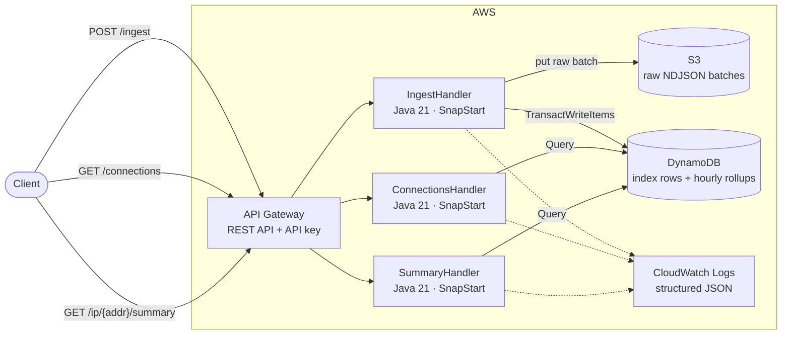
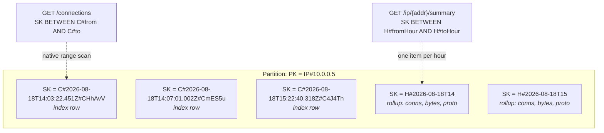
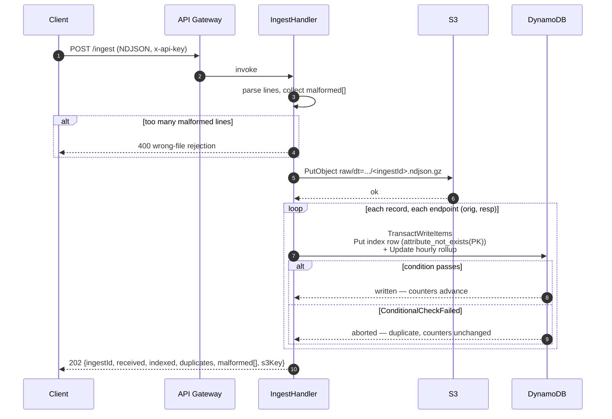
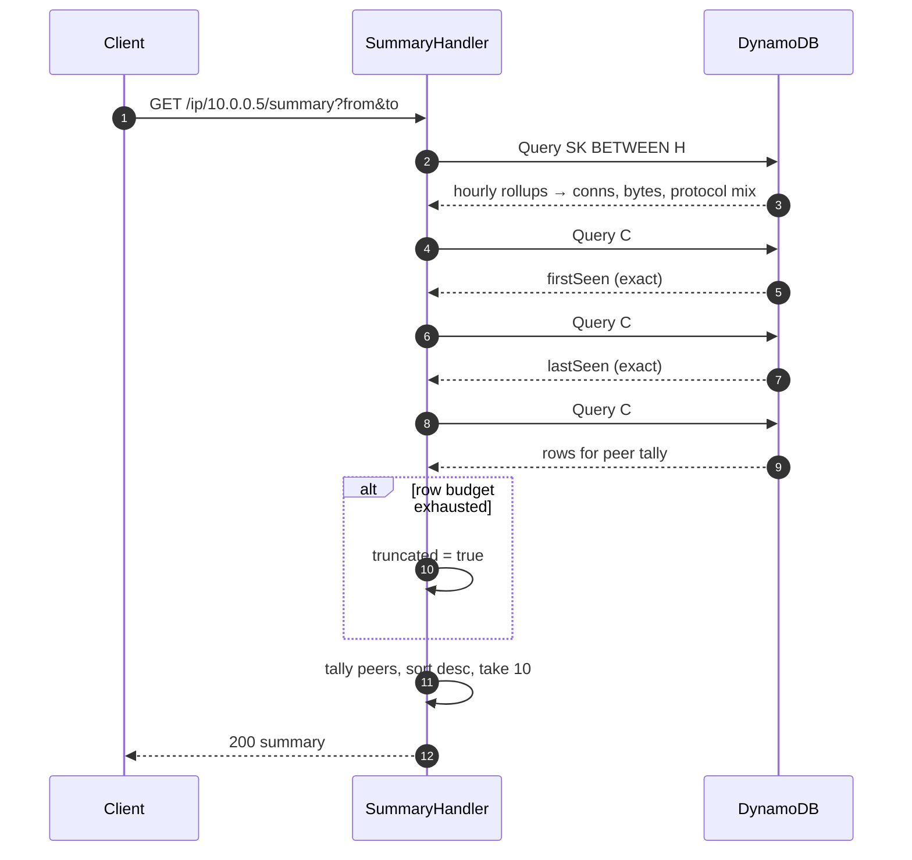

# flowdex — Design

Date: 2026-08-18
Status: Implemented. This document is the design as APPROVED, not as built.

> **Errata.** Building it changed six things, and one paragraph here is
> subtly wrong as written (see §6.2). Rather than silently rewriting the
> spec, each divergence is flagged inline with an **Errata** note. The
> authoritative description of the system as built is the "Design decisions"
> section of `README.md`, where every deviation is listed with its reason;
> when this document and the README disagree, the README is right.

## 1. Purpose

flowdex is a serverless index over Zeek `conn.log` records. It answers one
question quickly:

> Show me every connection involving this IP in this time window, and summarise
> what that IP was doing.

That question is the first move in most network-security triage: an alert names
an address, and the analyst needs its activity before anything else. Answering
it normally means running a SIEM. flowdex answers it with a bucket, a table, and
three functions.

### Context

This is a portfolio project. Its second purpose is to demonstrate AWS serverless
work — Lambda, API Gateway, DynamoDB, S3, Terraform — in a domain adjacent to
network security monitoring. Design decisions below are therefore optimised for
being *explainable*, not only for working. Where a shortcut would be defensible
in a weekend project but hard to defend in an interview, the spec takes the
longer path and says why.

## 2. Goals

1. Ingest Zeek `conn.log` records in NDJSON form, durably and idempotently.
2. Serve connection lookups by IP and time range, paginated.
3. Serve a per-IP activity summary: volume, protocol mix, top peers, first and
   last seen.
4. Deploy from source with one Terraform apply, and tear down with one destroy.
5. Be readable: a reviewer should understand the architecture from the README
   without cloning.

## 3. Non-goals

Stated explicitly in the README so they read as decisions rather than gaps.

- **Authentication and multi-tenancy.** An API Gateway API key gates access. It
  is not user authentication and is not presented as such.
- **Log types beyond `conn.log`.** No `dns.log`, `http.log`, `ssl.log`.
- **Live capture.** flowdex consumes files. It does not tap networks, read
  pcaps, or run Zeek.
- **Subnet or cross-IP queries.** Lookups are by exact address.
- **Retention, lifecycle, archival.** Data accumulates until the stack is
  destroyed.
- **Alerting, detection, scoring.** Retrieval only.
- **A user interface.** HTTP API only.
- **Scale beyond a single-partition-per-IP model.** Section 12 names what
  changes when that ceiling is reached.

## 4. Users

One: an analyst or engineer with a `conn.log` file and an IP address. There are
no roles, no accounts, no sharing.

## 5. Architecture

Three Lambda functions behind one API Gateway REST API, one DynamoDB table, one
S3 bucket. No VPC, no persistent compute, no servers.



### Why these choices

**REST API, not HTTP API.** API keys and usage plans are a REST API feature.
HTTP API is cheaper and lower-latency but cannot gate access this way without
adding a Lambda authorizer, which is more moving parts than the requirement
justifies.

**No Spring.** Framework startup is precisely the cost a function should not
pay. Handlers implement `RequestHandler` against AWS SDK v2 directly.

**SnapStart on all three functions.** Java cold starts of 1–3s drop to roughly
200–500ms by restoring a snapshot of the initialised JVM. SnapStart operates on
published versions, so Terraform must publish a version per function and point
the API Gateway integration at an alias (`live`), never `$LATEST`.

**DynamoDB on-demand billing.** No capacity planning, and cheapest by a wide
margin at this volume.

## 6. Data model

### 6.1 S3 — raw batches

One object per ingest, gzipped, never mutated:

```
raw/dt=<YYYY-MM-DD>/hour=<HH>/<ingestId>.ndjson.gz
```

`dt` and `hour` are ingest wall-clock UTC; `ingestId` is a UUIDv4. Index rows
carry the object key and the line number within it, so any query result can be
traced to the exact bytes that produced it.

The bucket has public access blocked, SSE-S3 encryption, and versioning off.

### 6.2 DynamoDB — single table

Table `flowdex`, partition key `PK` (string), sort key `SK` (string), on-demand.
Two row types share a partition:

| Row type | PK | SK | Purpose |
|---|---|---|---|
| Index | `IP#<addr>` | `C#<iso8601>#<uid>` | one per connection per endpoint |
| Rollup | `IP#<addr>` | `H#<yyyy-MM-ddTHH>` | hourly counters for that IP |

> **Errata.** "Twice" holds except for a self-connection (loopback, hairpin
> NAT), where `id.orig_h` equals `id.resp_h` and the two rows would be the same
> `PK` + `SK` — a collision, not two rows. As built, endpoints are the *distinct*
> addresses involved, so a self-connection writes one row.

Every connection is written **twice** — once under the originator, once under
the responder — so a query on either address finds it. Both rows are complete;
neither is a pointer to the other.

Timestamps are ISO-8601 UTC with exactly three fractional digits
(`2026-08-18T14:03:22.451Z`). Fixed width is load-bearing: it makes
lexicographic sort order equal chronological order, which is what allows a time
range to be a native sort-key `BETWEEN` with no secondary index.

**Index row attributes**

| Attribute | Notes |
|---|---|
| `uid` | Zeek connection uid |
| `ts` | ISO-8601 UTC, as above |
| `role` | `orig` or `resp` — this partition's side of the connection |
| `peer` | the other endpoint's address |
| `localPort`, `peerPort` | ports, oriented to this partition's side |
| `proto` | `tcp`, `udp`, `icmp` |
| `service` | Zeek's application-protocol guess, may be absent |
| `duration` | seconds, double, 0 when absent |
| `bytesOut`, `bytesIn` | oriented to this partition's side (see below) |
| `connState` | Zeek `conn_state`, may be absent |
| `s3Key`, `s3Line` | provenance |

**Byte orientation.** For the partition of address X: `bytesOut` is what X sent,
`bytesIn` what X received. When X is the originator, `bytesOut = orig_bytes` and
`bytesIn = resp_bytes`; when X is the responder, they swap. Orienting at write
time means read paths never need to know which side they are looking at.

**Rollup row attributes**

| Attribute | Type | Notes |
|---|---|---|
| `conns` | N | connections in this hour |
| `bytesOut`, `bytesIn` | N | oriented as above |
| `proto` | M | map of protocol name to count |

`proto` is a map updated with
`SET proto.#p = if_not_exists(proto.#p, :zero) + :one`. DynamoDB's `ADD` action
works only on top-level attributes, so the nested counter uses `SET` with
`if_not_exists` instead.

> **Errata — this does not work, and the reasoning above is where it goes
> wrong.** `ADD` is correctly ruled out for a nested path, but the `SET`
> replacement it falls back to cannot create the parent map and increment a
> child in the same expression: DynamoDB rejects that as overlapping document
> paths. Since a transaction may touch a given item only once, the rollup
> update has to *be* a single expression, so there is no single-expression
> form that maintains a nested map under contention at all. As built, protocol
> counts are **top-level attributes** named `proto#tcp`, `proto#udp`, … reached
> through an expression-name alias, and incremented with a single atomic `ADD`
> (`Keys.protoAttr`). This is storage only: the API response still nests them
> under `protocols`, so §8 is unaffected.

**First seen and last seen are deliberately absent from rollups.** DynamoDB
cannot express min or max in an update, and emulating it with conditional writes
produces transactions that abort on ordinary data. The summary handler instead
runs two `Limit 1` queries against the index rows — once forward, once reverse.
Two single-item reads, exact answers, no write-path complexity.



Sort keys are shown in stored order. `C#` sorts before `H#`, so index rows and
rollups occupy contiguous, separately-addressable ranges of the same partition.

## 7. Ingest and idempotency

Per connection record, per endpoint, one `TransactWriteItems` containing:

1. `Put` of the index row, conditional on `attribute_not_exists(PK)`.
2. `Update` incrementing that hour's rollup counters.

Re-POSTing the same file fails every condition, aborts every transaction, and
moves no counter. Idempotency and aggregation are solved by the same mechanism —
counters can only advance when the row they describe is genuinely new.

The raw object is written to S3 **before** indexing begins. If indexing dies
partway, the bytes are durable and re-POSTing is safe. Storage first, derived
data second.



### Parsing rules

Required fields: `ts`, `uid`, `id.orig_h`, `id.orig_p`, `id.resp_h`,
`id.resp_p`, `proto`. A line missing any of them is malformed.

Optional fields: `service`, `duration`, `orig_bytes`, `resp_bytes`,
`conn_state`. Absent numerics default to 0; absent strings are omitted from the
row rather than stored empty.

Zeek's `ts` is epoch seconds as a double and is converted to an `Instant` at
parse time.

### Limits

Request bodies are capped at **5 MB**. API Gateway allows 10 MB and Lambda's
synchronous payload limit is 6 MB; 5 MB leaves headroom and is documented rather
than discovered. Over the cap returns `413`. `Content-Encoding: gzip` is
accepted and decompressed before parsing.

> **Errata.** Keying on `Content-Encoding` does not survive API Gateway REST,
> which selects binary handling by `Content-Type` — a different header — so the
> natural pairing of `application/x-ndjson` with `Content-Encoding: gzip` would
> arrive mangled. As built, `binary_media_types` is `*/*` and the handler
> identifies gzip by its magic number `1f 8b` rather than by any header.
>
> A second cap not stated here exists as built: at most **5,000 records** per
> batch, also a `413`. See the README for the three ceilings that set it.

## 8. API

All responses are JSON. Every response carries the API Gateway request ID.
Errors share one shape:

> **Errata.** "Every response" means every response flowdex produces. A `403`
> for a missing API key or a `429` from the usage plan is generated by API
> Gateway before the function is invoked, and carries neither the header nor
> this envelope. That is not fixable without a custom gateway response body,
> and is documented in the README rather than worked around.

```json
{ "error": { "code": "...", "message": "...", "details": { } } }
```

### `POST /ingest`

Body is NDJSON — one Zeek `conn.log` record per line.

`202 Accepted`:

```json
{
  "ingestId": "b6f1…",
  "received": 1000,
  "indexed": 987,
  "duplicates": 12,
  "malformed": [ { "line": 47, "reason": "missing id.resp_h" } ],
  "s3Key": "raw/dt=2026-08-18/hour=14/b6f1….ndjson.gz"
}
```

`indexed` and `duplicates` count *records*, not rows; each record produces two
rows. They partition the parsed records, so
`indexed + duplicates = received - malformed.length` — 987 + 12 = 999 above.

> **Errata.** The original example read `"indexed": 984`, which did not
> reconcile with the other three numbers. Corrected to 987.

### `GET /connections`

| Parameter | Required | Notes |
|---|---|---|
| `ip` | yes | exact address |
| `from` | yes | ISO-8601, **inclusive** |
| `to` | yes | ISO-8601, **exclusive** |
| `limit` | no | default 100, max 1000 |
| `cursor` | no | opaque, from a previous response |

The key condition is `PK = IP#<ip> AND SK BETWEEN C#<from> AND C#<to>`. Because
stored sort keys always carry a `#<uid>` suffix, a record at exactly `to` sorts
above the bare `C#<to>` bound and is excluded — which is what makes the upper
bound exclusive without a sentinel character.

`200 OK` returns `{ "items": [...], "nextCursor": "..." }`. The cursor is the
base64url-encoded JSON of DynamoDB's `LastEvaluatedKey`, and is absent on the
final page.

### `GET /ip/{addr}/summary`

| Parameter | Required | Notes |
|---|---|---|
| `from` | yes | ISO-8601, inclusive |
| `to` | yes | ISO-8601, exclusive |

`200 OK`:

```json
{
  "addr": "10.0.0.5",
  "window":        { "from": "…", "to": "…" },
  "windowCovered": { "from": "…", "to": "…" },
  "connections": 4821,
  "bytesOut": 91223411,
  "bytesIn": 22119855,
  "protocols": { "tcp": 4602, "udp": 219 },
  "topPeers": [ { "addr": "10.0.0.9", "connections": 1204, "bytesOut": 5511, "bytesIn": 91224 } ],
  "firstSeen": "2026-08-18T14:03:22.451Z",
  "lastSeen":  "2026-08-18T15:59:08.117Z",
  "truncated": false
}
```

An unknown IP returns `200` with a zeroed summary, **not** `404`. "No data" is a
legitimate answer to a security question, and an analyst must be able to
distinguish it from a mistyped endpoint.



### Two precision caveats, both surfaced in the response

**Counters are hour-granular.** They come from rollup rows, so a request window
of 14:30–15:30 is served by the 14:00 and 15:00 buckets in full. `window` echoes
what was asked; `windowCovered` states the hour-aligned range the counts
actually describe. Rounding outward and saying so beats silently returning
numbers for a window nobody requested.

**`firstSeen`, `lastSeen`, and `topPeers` are exact** within the requested
window, because they are computed from index rows rather than rollups. The two
sets of numbers therefore need not reconcile, and the README says why.

**Truncation is never silent.** Peer tallying reads at most 5 pages of 1000
rows. When that budget is exhausted, `truncated` is `true` and the peer list is
labelled a partial result. Silent truncation in a security tool is how analysts
reach confident wrong conclusions.

## 9. Error handling

Ingest is **line-level tolerant, batch-level strict**. A malformed line is
collected and reported, not fatal. But when more than 10% of lines fail to
parse, the batch is rejected wholesale with `400` — that ratio means the wrong
file was sent, and half-ingesting it is worse than refusing it.

| Condition | Status |
|---|---|
| Body not valid NDJSON, or required fields missing | `400`, with per-line detail |
| Malformed lines exceed 10% | `400` |
| Body exceeds 5 MB | `413` |
| Invalid `ip`, unparseable `from`/`to`, or `from` ≥ `to` | `400` |
| Unknown IP | `200`, zeroed summary |
| Usage-plan quota exceeded | `429`, from API Gateway |
| DynamoDB throttling or contention | SDK retries with backoff, then `503` |
| Unhandled | `500`, request ID in the body, stack trace in logs only |

Logs are structured JSON so CloudWatch Logs Insights can query them. No request
bodies are logged.

## 10. Testing

**Unit — JUnit 5, no AWS.** Parser against real and deliberately broken lines;
key construction and sort-order properties; cursor encode/decode round-trips;
byte orientation for both roles; peer tally and its truncation boundary; the 10%
malformed threshold at 9%, 10%, and 11%.

**Integration — Testcontainers + LocalStack.** Real DynamoDB and S3 APIs in a
container, handlers invoked directly with constructed API Gateway event objects.
Required cases:

1. Ingest a sample file; assert index rows, rollup counters, and the S3 object.
2. **Ingest the same file again; assert `duplicates` equals the record count and
   that every counter is unchanged.** This test is the idempotency argument,
   executable.
3. Time-range boundaries: records exactly at `from` are included, records exactly
   at `to` are excluded.
4. Pagination across a cursor returns every row exactly once.
5. Summary math against a fixture whose expected values were computed by hand.
6. Truncation: a fixture exceeding the peer row budget sets `truncated`.
7. Unknown IP returns a zeroed `200`.

**Infrastructure.** `terraform validate` and `terraform fmt -check`.

**CI — GitHub Actions**, on pull request and on push to `main`: build, unit tests,
integration tests (LocalStack runs in Actions), Terraform checks. No AWS
credentials in the repository and no deploys from CI. Deployment is a documented
manual step; a public repo that cannot deploy itself is a feature.

## 11. Repository layout

```
flowdex/
  README.md                   architecture, diagrams, design decisions, run/deploy
  pom.xml                     Java 21, AWS SDK v2, shade plugin
  src/main/java/dev/orgon/flowdex/
    handler/                  IngestHandler, ConnectionsHandler, SummaryHandler
    zeek/                     ConnLogParser, ConnRecord
    store/                    IndexStore (DynamoDB), RawStore (S3)
    api/                      request parsing, error shape, cursor codec
  src/test/java/dev/orgon/flowdex/
                              unit tests + LocalStack integration tests
  infra/                      Terraform
  samples/                    small conn.log NDJSON fixtures
  docs/superpowers/specs/     this document
  .github/workflows/ci.yml
```

Handlers stay thin: parse the event, call a store, shape the response. Parsing,
key construction, and aggregation live in `zeek/` and `store/` where they can be
tested without AWS.

## 12. Deployment, cost, teardown

A dedicated IAM user with a scoped deploy policy. Credentials live in `~/.aws`
and never in the repository.

**Terraform state stays local and gitignored.** Remote state with a lock table
is right for a team and wrong for a solo project that would need bootstrap
infrastructure to hold state for a handful of resources. The README says exactly
this — a stated decision is a better signal than a cargo-culted S3 backend.

Terraform provisions: the REST API, three Lambda functions with published
versions and a `live` alias each, the usage plan and API key, the DynamoDB
table, the S3 bucket, IAM roles scoped to those two resources, log groups with a
short retention, and a **$5 AWS Budgets alarm** notifying by email at 80%.

Free tier covers this workload comfortably; expected cost is cents per month.
The budget alarm exists so that a mistake cannot quietly bill for a month.
Teardown is `terraform destroy`, documented in the README, and S3 objects must
be deleted first — the bucket is not `force_destroy`, deliberately, so that data
is never removed as a side effect of a destroy.

### Where this design's ceiling is

Named in the README, because knowing the ceiling matters more than raising it:

- **Hot partitions.** All rows for an IP share a partition. A busy server or a
  scanned address concentrates writes there. The fix is sharding the partition
  key by time or hash suffix, at the cost of scatter-gather reads.
- **Synchronous ingest.** Files arrive in a request body, capped at 5 MB. Real
  volume would land in S3 directly by presigned URL and trigger indexing by
  event notification, or stream through Kinesis or Kafka.
- **Per-record transactions.** Two rows per record, one transaction each, is
  simple and slow. Batching amortises it; batching plus idempotency is harder,
  which is the trade-off being made deliberately here.
- **Retrieval only.** Aggregations beyond per-IP hourly counters — top talkers
  across a whole subnet, arbitrary field search — want Athena over the S3
  objects or OpenSearch, not DynamoDB.

## 13. README requirements

The README is the artifact a reviewer actually reads. It must contain:

1. What flowdex does and the question it answers, in the first three sentences.
2. The service topology diagram (§5).
3. The data model diagram (§6.2) with the sort-key explanation.
4. The ingest sequence diagram (§7), presented as the idempotency story.
5. The read-path sequence diagram (§8).
6. A design-decisions section covering: why two rows per connection, why
   transactions, why first/last seen are not rollup attributes, why counters are
   hour-granular while peers are exact, why local Terraform state, why no Spring,
   why SnapStart, and why REST API over HTTP API.
7. The non-goals list (§3) and the ceiling list (§12).
8. Run instructions: build, test, deploy, sample ingest with `curl`, teardown.

Diagrams are inline mermaid. GitHub renders it natively, and a diagram a
reviewer must click away to see is a diagram that does not get seen.

## 14. Success criteria

1. `mvn verify` passes, including LocalStack integration tests, on a clean clone.
2. `terraform apply` produces a working stack; the sample file ingests and both
   query endpoints return correct results against it.
3. Re-ingesting the sample file changes no counter.
4. The documented teardown — empty the bucket, then `terraform destroy` — leaves no
   billable resources.
5. The README carries all four diagrams and the design-decisions section.
6. The work supports a resume entry: *serverless network-flow index — API
   Gateway and Java 21 Lambda ingesting Zeek connection logs to S3, with a
   DynamoDB time-series index serving IP and time-range queries; Terraform
   provisioned, GitHub Actions CI.*
